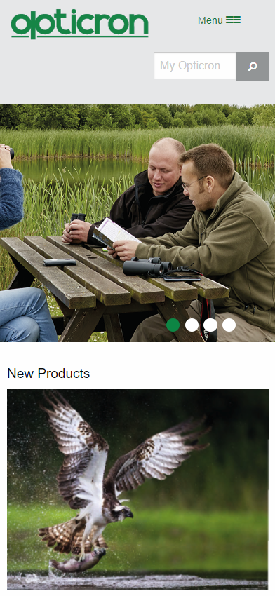
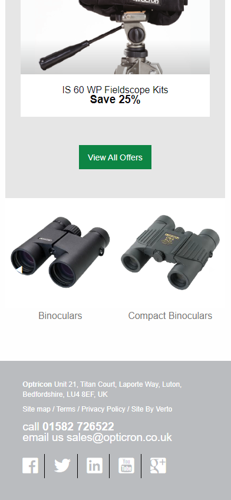
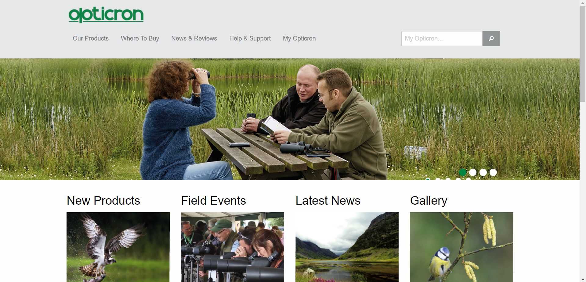
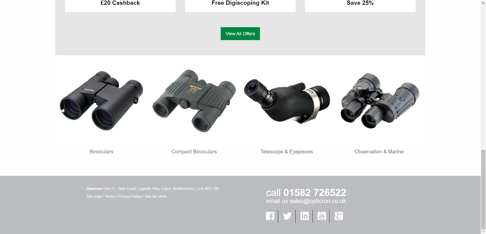

# verto_test_v2 by Jakub Krzywanski
## Project made with [Foundation 6][1]
Framework [Foundation documentation][docs]

That's my first project with Foundation 6 Framework

## Screenshots

### Mobile View

||
|:--:|
|*Top view*|

||
|:--:|
|*Footer view*|

### Desktop View

||
|:--:|
|*Top view*|

||
|:--:|
|*Footer view*|

[My GitHub](https://github.com/voote "This is my account")

[1]: https://get.foundation/index.html
[docs]: https://get.foundation/sites/docs/